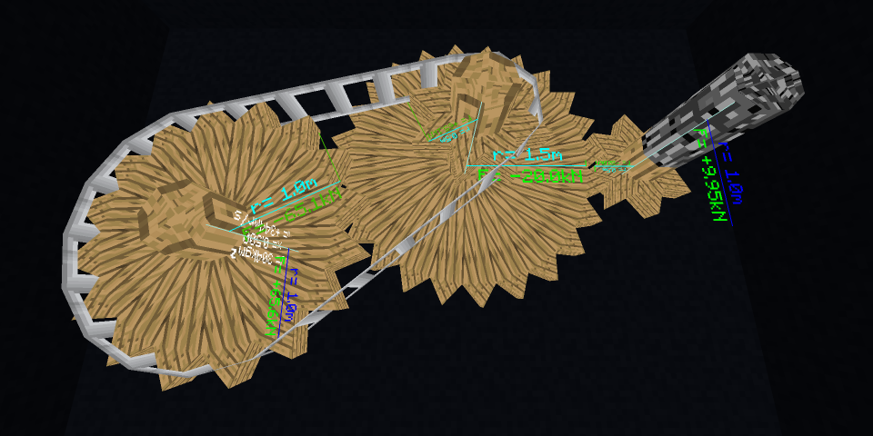

# ThermokineticEngineering
Initially this project contained several attempts of implementing realistic thermodynamics as a Minecraft Mod.
But after being requested to port RotaryCraft onto 1.12.2, I realized that this could actually be turned into a kind of RotaryCraft 1.12 replacement.

This mod will likely differ significantly from the original RotaryCraft and there are several improvements planned:
- much better performance for both rendering and server-side simulation
- more realistic rotational mechanics for the shaft system by introducing inertia
- less perpetual motion machine like power generation

The new Mod is developed basically from scratch in the `master-kinetics` branch. But the older attempts are kept around with their branches to potentially salvage code from.
